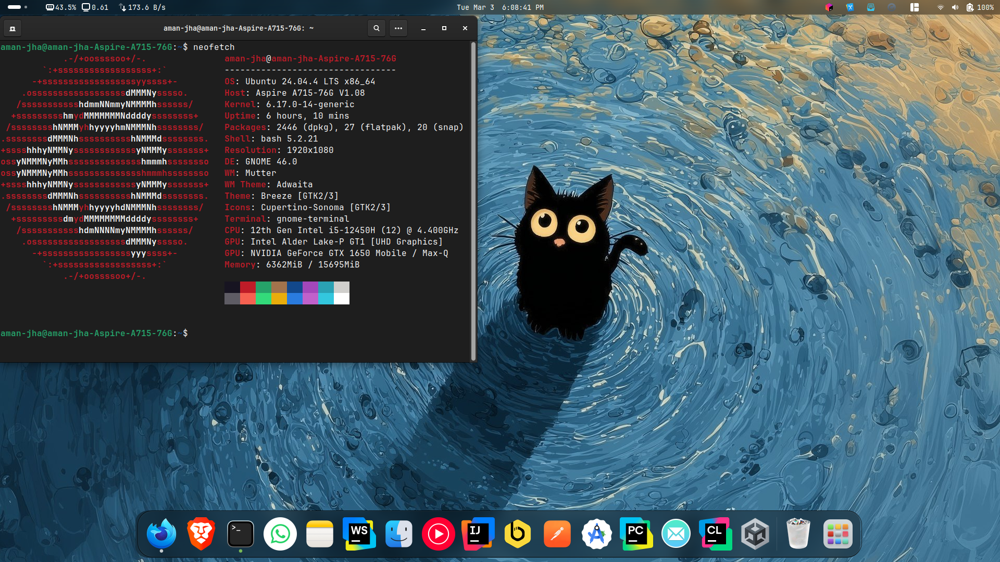
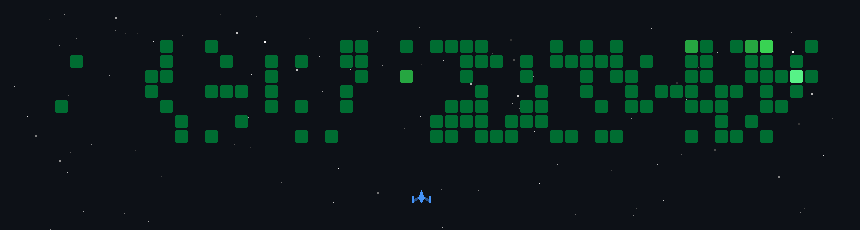

<p align="center">
  
</p>

<p align="center">
  
  
</p>

# ~$ whoami

```yaml
name: Aman Jha
age: 19
degree: B.Tech AI/ML
college: St. Thomas College of Engineering
focus: Backend Systems • Cloud • IoT • DevOps
mindset: Build → Scale → Optimize → Automate
````
<p align="center">
  
</p>

# Development Insights

<p align="center">
  
</p>

<p align="center">
  
</p>


<p align="center">
  
</p>
---

# GitHub Contribution Activity

<p align="center">
  
</p>

# Tech Arsenal

<p align="center">
  
</p>

Backend • Microservices • JWT • OAuth2 • WebSockets • Razorpay • Oracle Cloud • PM2 • SCP • Reverse Proxy  
Pandas • NumPy • Matplotlib • Seaborn • SQL • Data Engineering  
ESP32-S3 • MQTT • Relay Systems • Embedded Systems • IoT Automation  

# Philosophy

```diff
+ Build real hardware
+ Deploy real infrastructure
+ Secure production systems
+ Compete at national level
+ Engineer > Developer
```
<p align="center">
  <b>AIR 26</b> — Coding Ninjas National Hackathon  
  <br/>
  <b>National Frontend Hackathon Participant</b> — Sheriyans  
  <br/>
  <b>Backend Intern (Django)</b> — Surtle Security  
</p>
<p align="center">
  <a href="https://github.com/anuragjh">
    
  </a>
  <a href="https://www.linkedin.com/in/aman-jha-393468318/">
    
  </a>
  <a href="https://leetcode.com/u/aman_jha_dev/">
    
  </a>
  <a href="https://x.com/theamanjhadev">
    
  </a>
  <a href="https://portfolio-git-aman-mrwickjs-projects.vercel.app/">
    
  </a>
</p>

